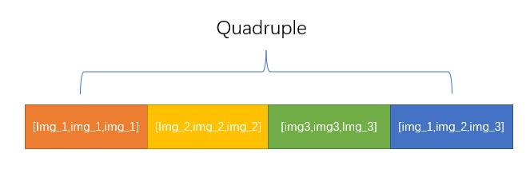

# basic ideas
consider our face can be represent by a set of {xyz} points

while the front face only contains the {xy} information, and side face only contains {yz} information.

our repo finds a way concatenating multiple face input together to get a more accurate represent of the face feature(just like waht Apple FaceID did)

# algo

we construct a Quadruple,in each Quadruple, the first 3 sample is random select from the same person and the 4th sample is a combination of the first 3 images.

look into ./multi_input/dataset_multi.py line74-148 for detail implementation.

As the combined iamged contains more information than each single image, so the probobility(classification logits) should meet this requirement:

logits(combine) > max(logits_1,logits_2,logits_3)

look into ./multi_input/partial_fc_multi.py line509-575 for detail implementation

# how to 
> \$ git clone --recurse-submodules git@github.com:KaleidoZhouYN/multi_input_face_recognition.git

## test

1. download r100 model checkpoint to multi_input/work_dirs/ms1mv3_r100:

    https://drive.google.com/file/d/1JSfz28fAE8kDNg4L_PgF9wSLL5JUKJ9Z/view?usp=sharing

2. prepare 3 different aligned face image of 1 person 

3. cp 3 image into ./demo/p1 and rename 0-3.jpg

4. do the same thing to another person to ./demo/p2

5. run

    > \$ cd multi_input 
    > \$ python inference.py

## train
1. download ms1m_v3 dataset from insightface
2. copy ms1m_v3 dataset into /dev/shm
3. run 
    > \$ cd multi_input 
    > \$ bash run_ms.sh

# example

similarity between p1 & p2(same person)

|   ||||
|:-:|:-:|:-:|:-:|
||0.718 |0.714 | 0.664|
||0.608 |0.565 | 0.509|
||0.729 |0.713 | 0.556|

similarity use add combine(f=f1+f2+f3 used in insightface): 0.743

similarity use multi_input(this repo): 0.876